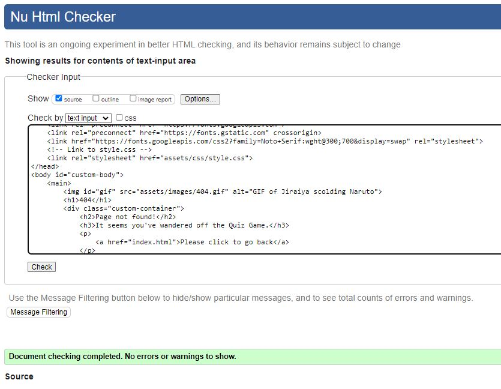

# Naruto Quiz Game

**Naruto Quiz Game** is centered around the Naruto Animation written and produced by Masashi Kishimoto. This website was developed for educational purposes as part of the Code Institute Diploma in Full-Stack Software Development. The project is designed for anyone looking to test their knowledge about Naruto's adventurous journey to become Hokage.

[live Preview of Naruto Quiz Game](https://sanitab17.github.io/Naruto-Quiz-Game/)

## Table of Contents

- [Naruto Quiz Game](#naruto-quiz-game)
  - [Table of Contents](#table-of-contents)
- [UI](#ui)
  - [User](#user)
  - [User Stories](#user-stories)
    - [Site owners Goals](#site-owners-goals)
    - [Requirements](#requirements)
  - [Design Choices](#design-choices)
    - [Fonts](#fonts)
    - [Icons](#icons)
    - [Colors](#colors)
    - [Structure](#structure)
- [Wireframes](#wireframes)
  - [Pages and Features](#pages-and-features)
    - [Features to be Implemented](#features-to-be-implemented)
- [Technology used](#technology-used)
- [Testing and Validation](#testing-and-validation)
  - [Functional Testing](#functional-testing)

# UI

## User

- Visually appealing.
- Test their knowledge.
- Entertain.

## User Stories

- As a user, I want to be able to play quiz using multiple devices.
- As a user, I want to be entertained.
- As a user, I want to test my knowledge.
- As a user, I want to be able to see my quiz score and review the correct answers after completing the quiz.

### Site owners Goals

- Entertain Users:
  - Provide users with a positive and engaging experience through entertaining quiz content.
- Test Their Knowledge:
  - Design quiz that effectively assess and challenge users' knowledge.
- Provide Clear Instructions:
  - Clearly instruct participants on how to play quiz.
- Randomize Question Order:
  - Randomize the order of questions to prevent users from memorizing the sequence and to add an element of surprise.

### Requirements

- Easy to navigate on various screen sizes and search engines.
- Visually appealing and user-friendly design.
- Quiz game should respond to user interactions quickly.

\
&nbsp;
[Back to Top](#table-of-contents)
\
&nbsp;

## Design Choices

### Fonts

For user-friendly and aesthetically pleasing website design, I have seamlessly integrated [Google Fonts](https://fonts.google.com/), [Noto Serif](https://fonts.google.com/noto/specimen/Noto+Serif).

### Icons

 For the favicon, I used open soure image from [Pixabay](https://pixabay.com/) and then converted it using [favicon.io](https://favicon.io/favicon-converter/).

### Colors

Colors were carefully selected from the main image to achieve a harmonious and user-friendly design using [Image Color Picker](https://imagecolorpicker.com/).

Use of various colors will explain below.

- #23272e: This color will be used for the text color.
- #ffab63, #ff7c14: These colors will be used to create a linear gradient for the body background, harmoniously matching with the image.
- rgba(50, 50, 93, 0.25), rgba(0, 0, 0, 0.3), rgba(10, 37, 64, 0.35): These three colors will be used for the box shadow.
- #fffff7: This color will be used for the background color of h1 and containers.
- #3b2b35: This color will be used for the border color of the buttons.
- #fff0cf: This color will be used for the background color of the buttons and the next button.
- #ffe3b2: This color will be used for the border color of the buttons.
- #14ff7c: This color will be used to indicate the correct answer.
- #ff0014: This color will be used to indicate the incorrect answer.
- #231f21: This color will be used for the border hover effect for buttons.
- #661400: This color will be used as the hover effect color for the next buttons.

### Structure

My website development will follow a mobile-first strategy, with an initial focus on smaller screens. I utilized Google Chrome DevTools to initiate styling for the Samsung Galaxy Fold, which has a width of 280px. I subsequently added breakpoints for screens with widths of 576px, 768px, and 992px.

\
&nbsp;
[Back to Top](#table-of-contents)
\
&nbsp;

# Wireframes

For structuring the website layout and design, I have chosen [Figma](https://www.figma.com/).

- Desktop
  

- Mobile

\
&nbsp;
[Back to Top](#table-of-contents)
\
&nbsp;

## Pages and Features

The website consists of a primary page, index.html, which serves as the central hub for the entire gaming experience. Additionally, a responsive 404 page is in place to enhance user experience in case of navigation errors.

- Favicon
  

- Header:

  - Presents a captivating Hero image that complements the title of the quiz, creating an engaging visual introduction.

\
&nbsp;
[Back to Top](#table-of-contents)
\
&nbsp;

- Main section:

  - Welcomes users with an inviting message, setting a friendly tone to encourage participation in the quiz.
  - Rules button is implemented to provide guidance on how to play the quiz.

\
&nbsp;
[Back to Top](#table-of-contents)
\
&nbsp;

- Play Theme Song section

  - Enables users to play the theme song during the quiz game. Play and pause buttons give users the choice to listen or not.

\
&nbsp;
[Back to Top](#table-of-contents)
\
&nbsp;

- Question Section

  - Displays quiz questions and four answer options. Users choose an answer, and a Next button appears. Correct answers are in green, incorrect in red. At the end, the user's score is shown with a button to play again.

\
&nbsp;
[Back to Top](#table-of-contents)
\
&nbsp;

- 404 Page:

  - A 404 page will be implemented and displayed if a user navigates to a broken link. A clickable link to the home page will be provided to ensure visitors can easily navigate back.

Mobile view

\
&nbsp;
[Back to Top](#table-of-contents)
\
&nbsp;

### Features to be Implemented

- Add more songs to play button image, to increase user expierence.
- Add difficulty levels.

\
&nbsp;
[Back to Top](#table-of-contents)
\
&nbsp;

# Technology used

- **[HTML](https://www.youtube.com/watch?v=3OTSsq9Y0P4&t=5s)** - The structure of the Website was developed using HTML as the main language.
- **[CSS](https://www.youtube.com/watch?v=nV9oaUglBTE)** - The Website was styled using custom CSS in an external file.
- **[Javascript](https://www.youtube.com/watch?v=wm4F0Zqxu5A)** - Font Awesome Icons were implemented using JavaScript.
- **[VSCode](https://en.wikipedia.org/wiki/Visual_Studio_Code)** - The website was developed using Visual Studio Code IDE.
- **[GitHub](https://en.wikipedia.org/wiki/GitHub)** - Source code is hosted on GitHub and delpoyed using Git Pages.
- **[Git](https://en.wikipedia.org/wiki/Git)** - Used to commit and push code during the development opf the Website.
- **[Google Fonts](https://fonts.google.com/)** - Google Fonts were used to style the text on the webpage.
- **[Favicon.io](https://favicon.io/favicon-converter/)** - Was used to convert and create favicon files.
- **[Figma](https://www.figma.com/)** - Was used to create both mobile and desktop wireframes.
- **[Microsoft Paint](https://www.microsoft.com/en-us/windows/paint#paintcocreator)** - Was used to create play and pause image.
- **[Voicy](https://www.voicy.network/search/naruto-sound-effects)** - Audio was sourced from voicy.
- **[Image Color Picker](https://imagecolorpicker.com/)** - Was used to detect colours in images.
- **[Convertio](https://convertio.co/)** - Was used to conver images to webp and png format.
- **[Multi Device Website Mockup Generator](https://techsini.com/multi-mockup/index.php)** - Was used to check responsiveness on different devices.
- **[ChatGPT](https://en.wikipedia.org/wiki/ChatGPT)** - Was used to create content and check for grammar.

\
&nbsp;
[Back to Top](#table-of-contents)
\
&nbsp;

# Testing and Validation

- HTML validation using [W3C Markup Validation](https://validator.w3.org/) results:
  - [index.html](https://validator.w3.org/nu/?doc=https%3A%2F%2Fsanitab17.github.io%2FNaruto-Quiz-Game%2F)
  - 404.html
  
- CSS validation using [W3C Jigsaw Validator](https://jigsaw.w3.org/css-validator/) results:
  - [CSS](https://jigsaw.w3.org/css-validator/validator?uri=https%3A%2F%2Fsanitab17.github.io%2FNaruto-Quiz-Game%2F&profile=css3svg&usermedium=all&warning=1&vextwarning=&lang=en)
- Java Script validation using [JSHint.](https://jshint.com/) results:
  
- Color Contrast Accessibility Validator using [A11Y](https://color.a11y.com/) resullts:
  - 
- Accessibility testing using [Wave](https://wave.webaim.org/) results:
  - [Wave Results](https://wave.webaim.org/report#/https://sanitab17.github.io/Naruto-Quiz-Game/)
- Lighthouse test results:
  
  - 

   -

\
&nbsp;
[Back to Top](#table-of-contents)
\
&nbsp;

## Functional Testing

